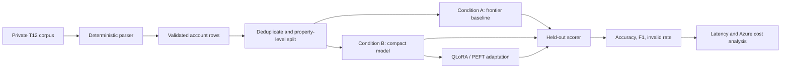

# IT 344: T12 Account Mapping Experiment

## Project question

Can a compact language model learn to map non-standard T12 account labels into a standardized chart of accounts more accurately than an unchanged frontier model, while remaining practical to deploy?

This repository is the course-specific experiment scaffold. The broader parser implementation lives in a separate private project. Confidential source workbooks are not committed here.

## Course scope

**IT 344 (this repo):** the model experiment. This covers the labeled account-to-COA dataset, leakage-safe splits, Condition A (frontier baseline) vs Condition B (compact model, base and QLoRA-adapted), held-out scoring, and error analysis.

**IT 287/312 (separate private project):** the systems work. This covers the deterministic T12 parser, corpus ingestion and validation, the production pipeline, and the Azure deployment and cost-per-T12 benchmark.

The parser output is treated as a fixed input to this experiment. Parser changes are not evaluated here.

## Current data update

The current deterministic T12 pipeline has been run across a 350-file private corpus.

| Item | Current status |
| --- | ---: |
| Source files profiled | 350 |
| Genuine workbooks | 348 |
| Candidate T12 statements | 342 |
| Byte-identical duplicates identified | 53 |
| Account lines extracted | 73,726 |
| Checkable row-sum validations passed | 65,593 / 67,108 (97.7%) |
| T12s currently graded "clean" | 248 |

These counts describe the parser corpus before the final ML training split. Duplicate files will not be allowed to cross train, validation, or test sets.

### Cleaning completed

- Reject unsupported files and non-T12 workbooks instead of force-parsing them.
- Assign sanitized workbook IDs so property names, filenames, and financial values are not exposed.
- Detect the candidate T12 sheet and normalize month/period columns.
- Extract account rows and values deterministically.
- Preserve financial values as exact decimals and validate account totals where possible.
- Flag unresolved structures rather than guessing.

### Before model training

- Finalize the standard chart-of-accounts label set.
- Remove or group duplicates.
- Review and label account-to-COA examples.
- Freeze a property-level held-out test set.
- Split the remaining examples into training and validation sets.

Raw workbooks remain private and git-ignored. This repo will contain only code, aggregate statistics, and synthetic or sanitized examples.

## Experimental design

### Primary A/B comparison

**Condition A: Frontier baseline**
- Unchanged frontier model
- Fixed system prompt
- No fine-tuning
- Same validated parser output and output schema

**Condition B: Compact model**
- Compact open-weight base model
- Same task definition and held-out examples
- Base-model results recorded before adaptation
- PEFT/LoRA/QLoRA adaptation performed only after the baseline is frozen

For the October preliminary demo, I will focus on the compact-model arm first: base compact model versus adapted compact model. The final project will compare the best compact condition back against the unchanged frontier baseline.

## Evaluation

Primary metric:

- **Exact account-mapping accuracy** on the frozen held-out test set.

Secondary metrics:

- Macro F1 across COA categories
- Category-level accuracy
- Invalid or unmapped output rate
- T12-level review-ready rate
- Repeated-run consistency
- p50/p95 latency
- Cost per T12 and per 1,000 account lines

The adaptation is considered successful only if it improves held-out mapping quality over the frozen compact-model baseline without creating material category-level regressions or a higher invalid-output rate. The final quality gate is whether the adapted compact model beats the unchanged frontier baseline under the same scoring rules.

## Envisioned workflow



## Repository layout

```text
.
├── README.md
├── config/
│   └── experiment.json
├── data/
│   └── README.md
└── src/
    └── evaluate.py
```

## Next milestone

1. Freeze the compact-model baseline configuration.
2. Prepare a leakage-safe labeled dataset split.
3. Run the initial compact-model condition.
4. Report exact accuracy, macro F1, invalid rate, latency, and error examples.
5. Run the adapted condition with the same held-out test set.
